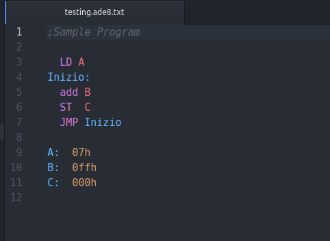

# a-d-e8-pad package

# ADE8 is a Grammar highlighter for ADE8 Instruction Set.

### Ade8 is a proccesor created by unimore professors for teacing purpose


## Known bugs:
- [ ] Not al mnemonic names suported
  - We support al mnemonic names in the case-sensitive version, present on the 8.6 version manual. Other case versions are not supported yet

## Istruzioni:

Il nome delle ettichette deve iniziare con una lettera maiuscola e finire con ":" se posti davanti a un istruzione, oppure senza ":" se posto come parametro.

I nueri esadecimali iniziano con "0" e finiscono con "h". In Mezzo ci vanno le due cifre esadecimali. es: 01ah 011h 0ffh 000h

I commenti iniziano con ";" e duranno fino alla fine della riga.
il file va salvato come file di testo ma in formato .ade8 oppure .ade8.txt

Una volta salvto il file, va assemblato con l'assemblatore fornito dal prof.

Esempio di codice

```asembly

;Commento su una linea

Inizio: ld A
;sinonimo di
;Inizio:
;       ld A
  ADD B
  ST  C
  JMP Inizio

A:  07h
B:  0ffh
C:  000h

```
## Screenshot:
 
